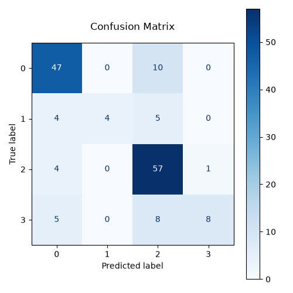
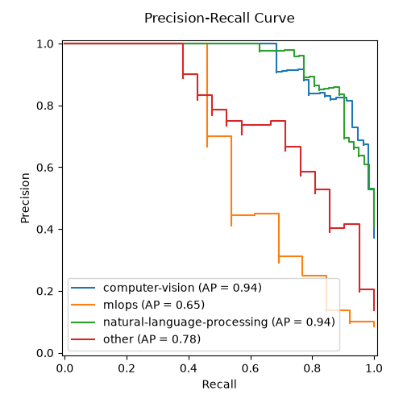
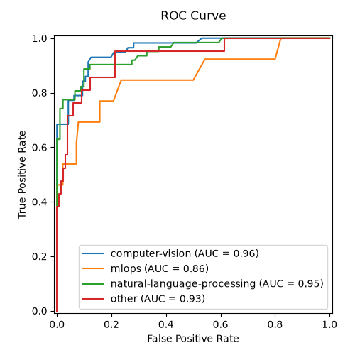
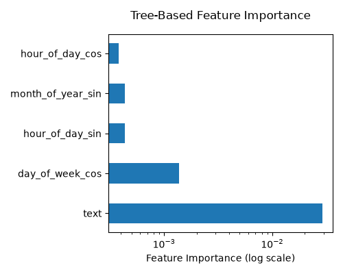

# TextOps

## Description

TextOps is a production simulation project designed to bridge the gap between model experimentation and reliable ML systems. While the core task is text classification, the primary focus is on engineering practices such as reproducibility, automation and lifecycle management.

## Plots

While the project is still WIP, since the README's looking a tad barren; here's some nice plots to look at, automatically generated after training and logged through MLFlow when applicable:

