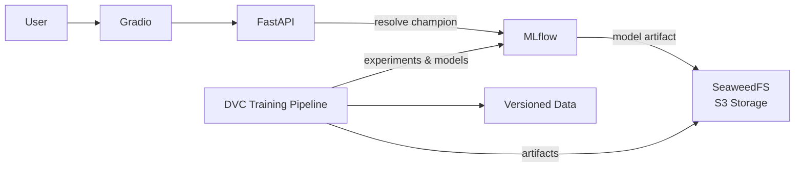

# TextOps

**TextOps is a production-oriented, end-to-end ML platform for reproducible experimentation, automated model governance, versioned artifact management, and decoupled model serving.**

The project uses a deliberately small text-classification problem as a vehicle for engineering the infrastructure around an ML system rather than focusing on model complexity.

The complete lifecycle is automated from **versioned data → preprocessing → embeddings → training → evaluation → model promotion → registry → inference**.

The application is fully containerized and can be started locally with Docker Compose.

---

## Why TextOps?

A trained model is only one component of an ML system.

In a production setting, the surrounding system has to answer questions such as:

* Can training be reproduced from a known state?
* Which data and configuration produced a particular model?
* Can experiments be compared systematically?
* How is a new model evaluated against the current production model?
* How do we prevent an aggregate metric from hiding regressions in important classes?
* How does the serving layer know which model is currently active?
* Can a new model implementation be introduced without restructuring the entire pipeline?
* Can expensive intermediate computations be reused safely?

TextOps explores these questions by building the infrastructure around a small but intentionally imperfect classification problem.

The dataset contains approximately **800 samples across four classes**, with two classes substantially underrepresented. This makes the model-promotion problem particularly interesting: improving aggregate performance must not come at the expense of minority-class recall.

The classifier itself is intentionally conventional. The focus of the project is the **system surrounding the model**.

---

## Architecture

TextOps consists of independent services for the user interface, inference, model lifecycle management, artifact storage, and training.



The application stack is brought up with Docker Compose:

```text
Gradio
   │
   ▼
FastAPI
   │
   ▼
MLflow Model Registry
   │
   ▼
SeaweedFS
```

The training pipeline operates independently:

```text
Data
 │
 ▼
Preparation
 │
 ▼
Preprocessing
 │
 ▼
Embedding Generation
 │
 ▼
Training + Hyperparameter Search
 │
 ▼
Evaluation
 │
 ▼
Promotion Gate
 │
 ├── rejected
 │
 └── promoted → MLflow Champion
                       │
                       ▼
                FastAPI serving
```

This separation allows the model-development lifecycle to evolve without requiring changes to the inference application.

---

## Core Engineering Concepts

### Reproducible ML Pipeline

The training workflow is implemented as a modular **DVC pipeline**:

```text
data preparation
     ↓
preprocessing
     ↓
embedding generation
     ↓
training
     ↓
evaluation
     ↓
promotion
```

DVC tracks the relevant data, pipeline outputs and artifacts, allowing the pipeline to determine which stages actually need to be rerun after a change.

The repository versions:

* raw data
* processed data
* generated embeddings
* training configuration
* model artifacts
* evaluation results

A change to an upstream stage therefore propagates only to the stages that depend on it rather than requiring the entire pipeline to be executed again.

---

### Automated Model Governance

Model selection is deliberately not based on a single aggregate metric.

The classification problem contains significantly underrepresented classes, so a candidate model is promoted only when **both** conditions are satisfied:

$$
\min_k \mathrm{Recall}_k \geq 0.75
$$

and

$$
\mathrm{F}_1(\text{candidate}) \geq \mathrm{F}_1(\text{champion}) + 0.01
$$

In other words:

1. Every class must achieve at least **0.75 recall**.
2. The candidate must improve F1 by at least **0.01** over the current champion.

This prevents a model from being promoted merely because it improves performance on majority classes while substantially degrading performance on minority classes.

The threshold also introduces a small margin between successive models, avoiding promotions based on negligible metric fluctuations.

---

### Champion-Based Model Lifecycle

A successful training run does not require a developer to manually select a model for serving.

After evaluation:

```text
candidate model
      │
      ▼
promotion gate
      │
      ├── reject
      │
      └── promote
            │
            ▼
      MLflow "champion"
            │
            ▼
      FastAPI resolves champion
            │
            ▼
      model loaded and cached
```

MLflow provides experiment tracking and model registry functionality, while **SeaweedFS** provides S3-compatible artifact storage.

The inference service resolves the `champion` alias rather than depending on a hard-coded model version.

Consequently, promotion changes the model served by the application **without requiring changes to the inference code**.

---

### Model-Agnostic Training

The infrastructure is designed around interchangeable classifier implementations rather than a classifier being embedded directly into the pipeline.

Model selection, training parameters and hyperparameter-search configuration are defined externally in `params.yaml`.

This allows the same lifecycle to be reused across different model implementations:

```text
                 ┌───────────────────┐
                 │   Model Config    │
                 │   params.yaml     │
                 └─────────┬─────────┘
                           │
              ┌────────────▼────────────┐
              │   Model Implementation  │
              └────────────┬────────────┘
                           │
                           ▼
            Training → Evaluation
                           │
                           ▼
                       Promotion
                           │
                           ▼
                        Serving
```

The currently implemented classifier is a **Random Forest** with grid-search-based hyperparameter optimization. The architecture is intended to make experimentation with alternative model families a change to the model layer rather than a redesign of the surrounding lifecycle.

---

### Embedding Caching

Text is transformed into embeddings using **SentenceTransformers** (`all-MiniLM-L6-v2`).

Embedding generation can be unnecessarily expensive when inputs have not changed, particularly when repeatedly experimenting with downstream classifiers.

TextOps therefore implements reusable embedding caching so that previously computed representations can be reused rather than regenerated.

The cache is used during training, and targeted tests verify that cached embeddings remain equivalent to freshly generated representations.

The caching implementation is intentionally treated as part of the ML pipeline rather than as an opaque optimization, since incorrect cache invalidation or inconsistent representations could silently affect model behavior.

---

## Technologies

| Component                  | Technology                     | Purpose                                          |
| -------------------------- | ------------------------------ | ------------------------------------------------ |
| Pipeline & data versioning | **DVC**                        | Reproducible stages, data and artifact tracking  |
| Experiment tracking        | **MLflow**                     | Runs, parameters, metrics and experiment history |
| Model registry             | **MLflow**                     | Model versions and champion lifecycle            |
| Artifact storage           | **SeaweedFS**                  | S3-compatible model/artifact storage             |
| Embeddings                 | **SentenceTransformers**       | Text representation                              |
| Model                      | **scikit-learn Random Forest** | Multiclass classification                        |
| Inference                  | **FastAPI**                    | Model-serving API                                |
| User interface             | **Gradio**                     | Interactive inference client                     |
| Orchestration              | **Docker Compose**             | Local multi-service deployment                   |
| Development                | **VS Code Dev Containers**     | Reproducible development environment             |
| Dependencies               | **uv**                         | Python dependency and workspace management       |
| Validation                 | **Pydantic**                   | API/input schema validation                      |
| Testing                    | **pytest**                     | Automated tests                                  |
| Code quality               | **Ruff, yamllint, Pylance**    | Linting, formatting and static typing            |
| Git hooks                  | **pre-commit**                 | Automated local quality checks                   |

---

## Project Structure

At a high level, the repository is organized into separate workspaces and services:

```text
TextOps
├── src/text_classifier/     # DVC training pipeline
├── api/                     # Inference API and model serving
├── app/                     # Gradio client frontend
├── common/                  # Shared utilities
│
├── ...                      # Other project configuration and tooling
│
├── compose.yaml             # Local service orchestration
├── params.yaml              # DVC pipeline parameters
├── dvc.yaml                 # DVC pipeline definition
└── pyproject.toml           # uv workspace configuration
```


The repository uses a **uv root project with three uv workspaces**, keeping the individual application components independently manageable while retaining a coherent development environment.

---

## Getting Started

### Prerequisites

The application requires:

* Docker
* Docker Compose

For development, the repository also provides a VS Code Dev Container.

---

### 1. Prepare the Environment

Before running the project, copy the example environment file:

```
cp .env.example .env
```

The credentials in `.env.example` are for the local SeaweedFS setup and are safe to share. If you connect to an external S3-compatible service such as AWS, replace them with your own credentials in `.env`.

**Do not edit or commit `.env.example` with real credentials.** Keep your credentials in `.env`, which is excluded from version control.

---

### 2. Run the Training Pipeline

The training pipeline is provided as a separate Compose service.

To execute only stages affected by changes:

```bash
docker compose --profile train-pipe run --rm train-pipe
```

DVC determines which stages require execution.

To force execution of the complete pipeline:

```bash
docker compose --profile train-pipe run --rm train-pipe --force
```

The pipeline performs:

```text
data preparation
→ preprocessing
→ embedding generation
→ training
→ evaluation
→ promotion
```

After completion, experiment results, metrics and produced models can be inspected through MLflow.

---

### 3. Start the Application

Start the application stack with:

```bash
docker compose up
```

This starts the application services, including:

* Gradio frontend
* FastAPI inference service
* MLflow
* SeaweedFS artifact storage

Once the services are running, open the Gradio interface at:

```text
http://localhost:7860/
```

The inference API is available separately and is consumed by the Gradio frontend.

The MLflow server can be accessed at:

```
http://localhost:5000/
```

---

## Experimentation

Training parameters and hyperparameter-search configuration are defined in:

```text
params.yaml
```

This makes it possible to experiment with:

* model configuration
* training parameters
* hyperparameter-search spaces
* other pipeline parameters

The resulting runs and metrics are recorded in MLflow, while model artifacts are stored through the S3-compatible artifact backend.

The pipeline can therefore be used interactively to explore different configurations while retaining the resulting experiment history and artifacts.

---

## Model Promotion in Practice

Suppose the current champion has an F1 score of `0.86`.

A candidate producing:

```text
F1:                   0.875
minimum class recall: 0.78
```

would be eligible for promotion.

A candidate producing:

```text
F1:                   0.88
minimum class recall: 0.71
```

would be rejected despite having the better aggregate F1 score.

Likewise:

```text
F1:                   0.868
minimum class recall: 0.80
```

would be rejected because the improvement over the champion is below the required `0.01` margin.

This makes the promotion logic explicit and reproducible rather than relying on manual model selection.

---

## Testing and Code Quality

The project uses several layers of automated validation.

### Tests

`pytest` covers service behavior and selected pipeline failure points, including:

* API/service responses
* cached vs. freshly generated embeddings
* consistency between training-time and inference-time model processing

### Static Validation

The development workflow uses:

* **Ruff** for linting and formatting
* **Pylance** in strict mode for static typing
* **Pydantic** for inference schema validation
* **yamllint** for YAML validation
* **pre-commit** for automated local checks

---

## Reproducibility

The intended workflow is that a known repository state, together with its versioned data and configuration, is sufficient to reproduce the corresponding pipeline outputs.

The project versions the relevant intermediate representations and artifacts rather than treating the trained model as an isolated binary output.

DVC currently uses local storage for its remote artifacts. Remote S3-backed DVC storage is a planned extension for making the same workflow suitable for a multi-machine environment.

---

## Scope and Design Philosophy

TextOps is intentionally **not** presented as a cloud-scale production deployment.

The system currently runs locally through Docker Compose and does not yet include a production deployment platform, automated image publishing or CI/CD-based deployment.

Instead, the project focuses on the architectural and engineering problems that arise **between an ML experiment and a maintainable ML system**:

* reproducibility
* data and artifact lineage
* modular pipelines
* experiment tracking
* model governance
* automated promotion
* separation of training and serving
* model interchangeability
* efficient intermediate computation
* reproducible environments

The infrastructure is designed so that these concerns can be extended toward a larger deployment environment without changing the fundamental model lifecycle.

---

## Status

TextOps is an actively developed engineering project.

The current implementation provides the complete local workflow from training data through automated model promotion to user-facing inference.

Planned extensions include:

* CI-based automated testing
* automated container image builds
* remote DVC storage
* stronger integration and end-to-end test coverage
* deployment beyond the local Docker Compose environment
